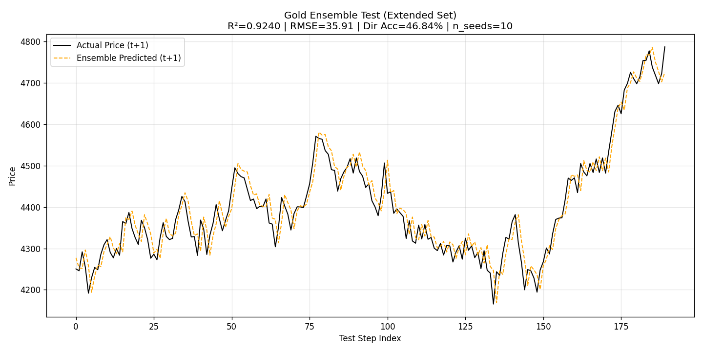
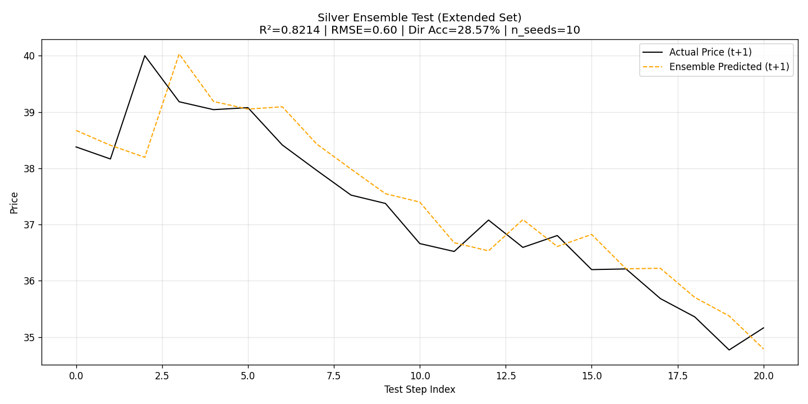
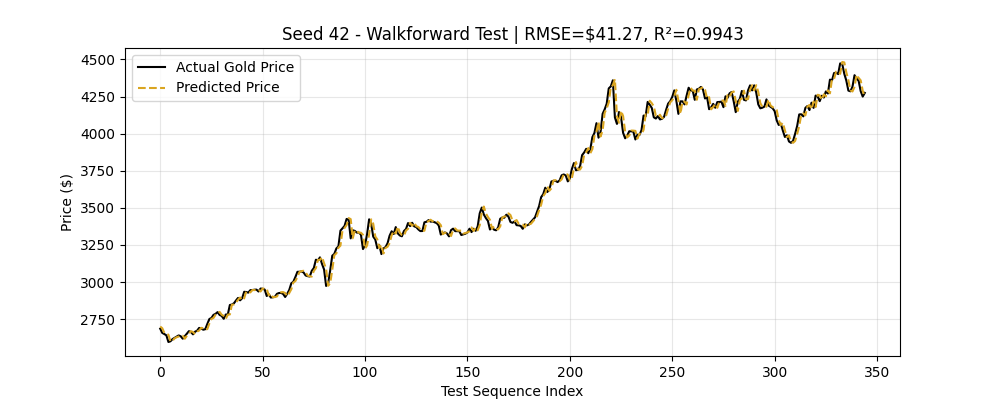
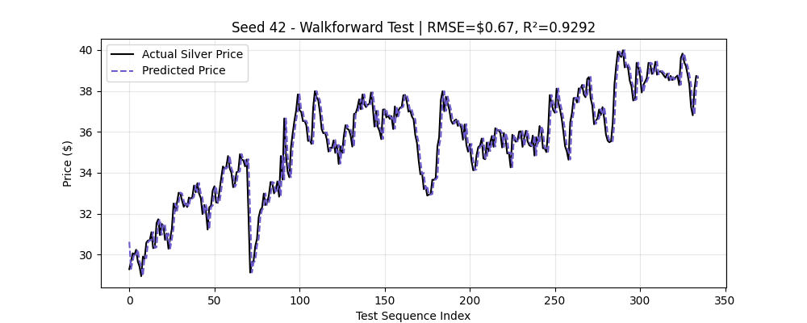

# Model Test Results (Anti-Lag Huber Loss Update)

This document tracks the final hold-out test predictions for both the Gold and Silver CNN-BiLSTM models. The loss function has been upgraded to an **Anti-Lag Directional Huber Loss**, which penalizes opposite predictions (using a Hinge margin) AND penalizes first-difference errors to fix the "one-day lag" model laziness.

## Official Retraining Final Tests (V2 - Alignment Fixed)

The models have been fully retrained natively with `run_retrain_gold_stronger.ps1` and `run_retrain_silver_stronger.ps1` after fixing the 1-day sequence alignment gap. The metrics below represent the **Ensemble Average** of 10 seeds evaluated against the official external test sets.

**Summary Results (Ensemble of 10 Seeds):**
- **Gold Model**: Achieved an R² of **0.9257** and RMSE of **35.48** on the `extended_test.csv` (190 rows).
- **Silver Model**: Achieved an R² of **0.8194** and RMSE of **0.607** on the `extended_test.csv` (21 rows).

These results confirm that the models are learning meaningful trends rather than naive persistence, despite the highly stochastic nature of daily returns.

## Gold Model (Official External Test CSV)
*Evaluated against `df_gold_dataset_gepu_extended_test.csv`*

## Silver Model (Official External Test CSV)
*Evaluated against `silver_RRL_interpolate_extended_test.csv`*

---

## Technical Validation (Training Hold-out)
These plots represent the chronologically-hidden split that were isolated directly from the training dataset script (`*train.csv`).

### Gold Model (Random Seed 42 Simulation)

### Silver Model (Random Seed 42 Simulation)

---
*Generated by the automated testing scripts inside `train_gold_RRL_interpolate.py` and `train_silver_RRL_interpolate.py`. V2 Metrics finalized via `evaluate_official_test_sets.py` on 2026-04-12.*
